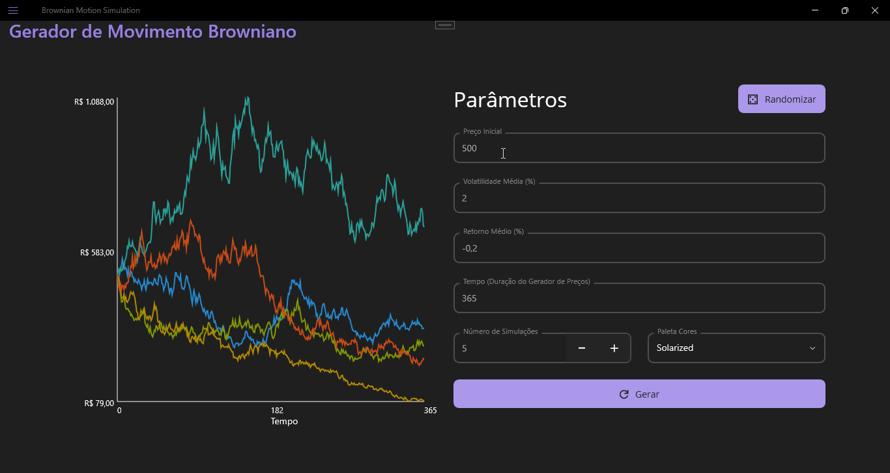
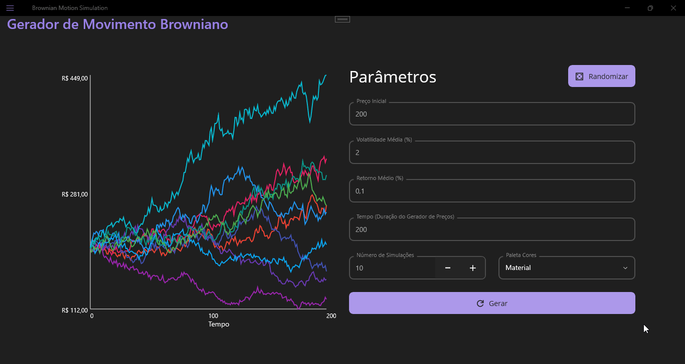
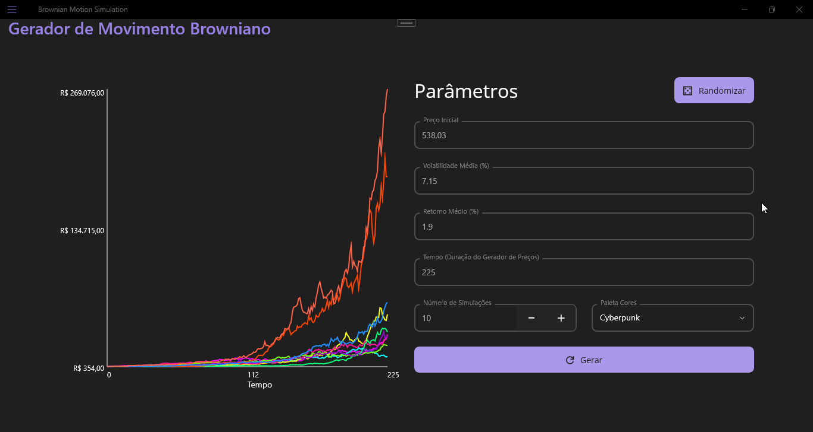

# .NET 9 Maui Desktop App
Gerador de Movimento Browniano com input de parâmetros para controle de simulações.

---
## Geração de Múltiplas Simulações

## Validação Completa de Campos

## Controle de Paleta de Cores

## Randomizador de Parâmetros

